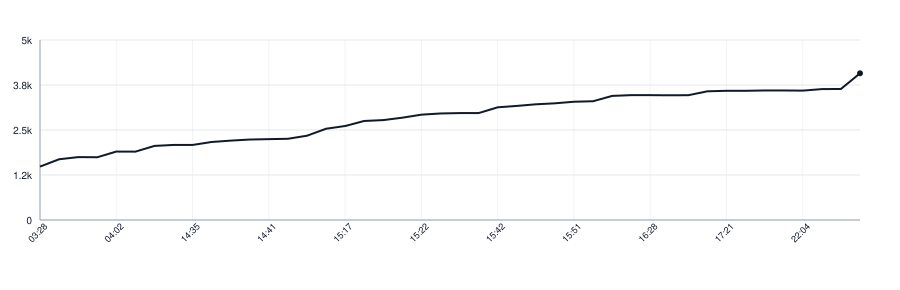

# workcorpus-kotlin

[](https://github.com/apakabarlabs/workcorpus-kotlin/actions/workflows/tests.yml)
[](https://apakabarlabs.github.io/workcorpus-kotlin/)

Reads the work a reading exercise is built on: its text, how it is divided, and
what a reading of it is held to.

A work is written once, as one file, and read by everything that touches it —
the tool that records it, the tool that measures the recording, and the app a
reader holds. One reading of that file, in one place, is what keeps the three
from disagreeing about what is written.

This is a Kotlin/JVM port of [workcorpus-swift](https://github.com/apakabarlabs/workcorpus-swift),
with the same names and behaviour. The work files its tests read are synced from
there with `make sync-yaml`, and a test holds the copies against that repository,
so the ports cannot quietly drift apart.

## What it holds

- **A piece**, what a reader takes in one sitting: a sonnet, a stanza, a scene.
  It carries its own title, because only the work knows what to call it.
- **How a piece is cut** for a single attempt. The work says it; nothing here
  computes it, since how a sonnet falls into quatrains or a scene into speeches
  is the work's own shape. A stage the work says nothing about is read line by
  line.
- **A part**, a run of pieces the work is divided into.
- **What a reading is held to**: the score a word counts as difficult at and the
  bands a stage is coloured by.

What it does not hold is how long a piece should be, or how many pieces a work
has. Those belong to the work file, and a library that knew them could serve
only one book.

## Use

A work file names the work, its language and what a reading of it is held to,
and files its pieces under the sections they belong to:

```yaml
slug: poems
language: eng
title: Poems
reading:
  untouched_below: 0.001
  begun_below: 0.5
  most_below: 1.0
  difficult_word_score: 3
  free: ['1']
sections:
  - title: Opening poems
    summary: The first part.
    pieces:
      - id: '1'
        title: First poem
        lines: [The first line., The second line., The third line.]
        cuts:
          block: [2, 1]
```

```kotlin
import fm.apakabar.workcorpus.ReadingStage
import fm.apakabar.workcorpus.WorkCorpus

val work = WorkCorpus.decodeWork(yaml)
val piece = work.pieces[0]
val firstBlock = piece.cuts(ReadingStage.BLOCK)[0]

check(work.language == "eng")
check(firstBlock == 0..1)
```

`decodeWork` reads a work file, `decodeWorkFromBook` an assembled book, and
`WorkCorpus.work(language, pieces, reading)` assembles values a caller already
holds. `Work.language` is the language tag the work gives, such as `en`, `eng`
or `en-GB`; nothing here assumes one. Every number a work carries is a YAML
integer that fits in 32 bits.

All three refuse a malformed work with an error that says what is wrong and
where: pieces not numbered from one in order, parts that do not cover the work
exactly once, reading thresholds out of order, a language that is not a
language tag, a number that is not a 32-bit integer, or cuts that do not add up
to the lines of their piece.

## Install

The library is published to Maven Central:

```kotlin
repositories {
    mavenCentral()
}

dependencies {
    implementation("fm.apakabar:workcorpus-kotlin:0.5.0")
}
```

The API is not settled before 1.0 and may change between minor versions.

## Documentation

The [Dokka API reference](https://apakabarlabs.github.io/workcorpus-kotlin/) is generated from the public Kotlin API and deployed by GitHub Actions.

## Develop

```bash
make test
make lint
make docs
make build
make sync-yaml   # after the work files change in workcorpus-swift
```

Releases are published by the [Release workflow](https://github.com/apakabarlabs/workcorpus-kotlin/actions/workflows/release.yml).

## Lines of Code

<picture>
  <source media="(prefers-color-scheme: dark)" srcset=".github/loc-history-dark.svg">
  <source media="(prefers-color-scheme: light)" srcset=".github/loc-history-light.svg">
  
</picture>
